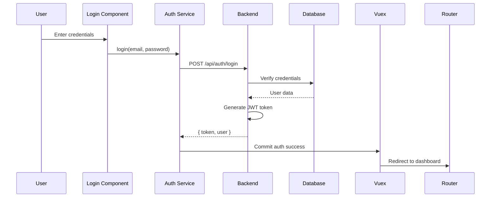
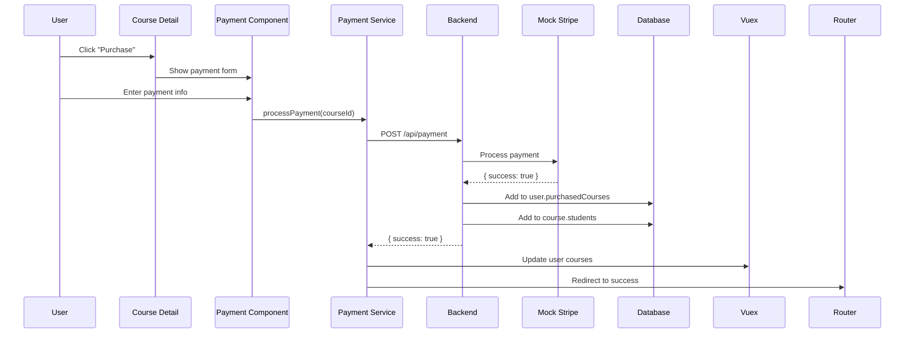
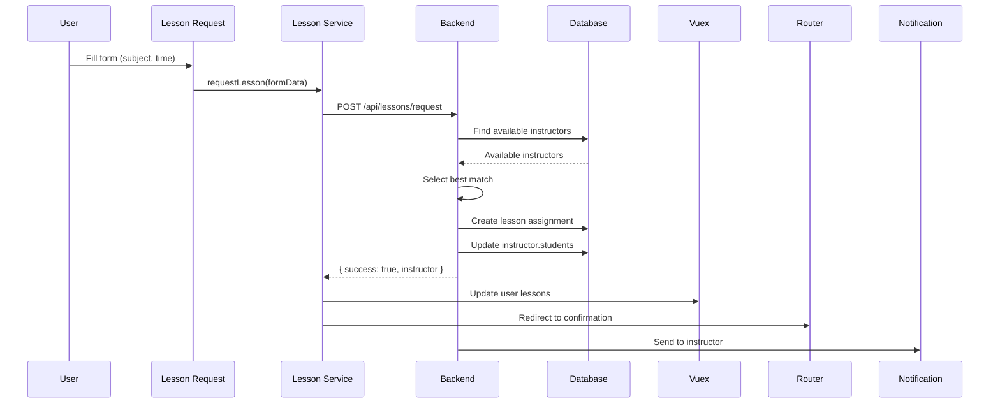

# Educational Platform Implementation Plan

## Phase 1: Project Setup and Configuration

### 1.1 Backend Setup
- [ ] Initialize Node.js project: `npm init -y`
- [ ] Install dependencies: `express`, `jsonwebtoken`, `bcryptjs`, `body-parser`, `cors`
- [ ] Create basic Express server with middleware
- [ ] Set up folder structure: controllers, models, routes, middlewares
- [ ] Create initial `db.json` file with empty data structures

### 1.2 Frontend Setup
- [ ] Initialize Vue.js project: `vue create frontend`
- [ ] Install Vue Router: `vue add router`
- [ ] Install Vuex: `vue add vuex`
- [ ] Install Bootstrap: `npm install bootstrap`
- [ ] Set up basic layout with navigation
- [ ] Create folder structure: components, views, store, router

### 1.3 Initial Database Structure
```json
{
  "users": [],
  "instructors": [],
  "admins": [],
  "courses": [],
  "lessons": []
}
```

## Phase 2: Role-Based Authentication System

### 2.1 Backend Implementation
- [ ] Create User model with role-based structure
- [ ] Implement JWT authentication middleware
- [ ] Create auth controller with login/register functions
- [ ] Implement role-based access control middleware
- [ ] Create auth routes: `/api/auth/login`, `/api/auth/register`, `/api/auth/me`

### 2.2 Frontend Implementation
- [ ] Create login/register components
- [ ] Implement Vuex auth module
- [ ] Create authentication service
- [ ] Implement route guards for protected routes
- [ ] Create user profile component

### 2.3 Data Flow


## Phase 3: Course Management System

### 3.1 Backend Implementation
- [ ] Create Course model
- [ ] Implement course controller
- [ ] Create course routes: `/api/courses`, `/api/courses/:id`
- [ ] Implement admin-only course creation endpoint

### 3.2 Frontend Implementation
- [ ] Create course list component
- [ ] Create course detail component
- [ ] Create course card component
- [ ] Implement course browsing functionality
- [ ] Create admin course management interface

### 3.3 Sample Course Data
```json
{
  "id": "math101",
  "title": "Introduction to Mathematics",
  "description": "Basic math concepts for beginners",
  "instructor": "instructor1",
  "price": 49.99,
  "students": []
}
```

## Phase 4: Payment System Implementation

### 4.1 Mock Stripe API
- [ ] Create payment controller
- [ ] Implement mock Stripe payment processing
- [ ] Create payment success/failure responses
- [ ] Implement course assignment logic

### 4.2 Backend Endpoints
- [ ] `POST /api/payment` - Process payment
- [ ] `GET /api/courses/purchased` - Get user's courses

### 4.3 Frontend Implementation
- [ ] Create payment component
- [ ] Implement course purchase flow
- [ ] Create payment success page
- [ ] Create purchased courses list
- [ ] Implement payment error handling

### 4.4 Payment Flow


## Phase 5: Instructor-Student Matching System

### 5.1 Backend Implementation
- [ ] Create lesson request controller
- [ ] Implement matching algorithm
- [ ] Create notification system
- [ ] Implement lesson routes: `/api/lessons/request`, `/api/lessons/my-lessons`

### 5.2 Matching Algorithm
```javascript
function findBestInstructor(subject, preferredTime) {
  // Filter instructors by subject
  const subjectInstructors = instructors.filter(i => i.subject === subject);

  // Check availability
  for (const instructor of subjectInstructors) {
    if (instructor.availability.includes(preferredTime)) {
      return instructor;
    }
  }

  return null; // No available instructor
}
```

### 5.3 Frontend Implementation
- [ ] Create lesson request form
- [ ] Create instructor dashboard
- [ ] Create student lesson list
- [ ] Implement real-time notifications (simulated)

### 5.4 Matching Flow


## Phase 6: Admin Interface

### 6.1 Backend Implementation
- [ ] Create admin controller
- [ ] Implement user management endpoints
- [ ] Implement course management endpoints
- [ ] Create admin routes with role protection

### 6.2 Frontend Implementation
- [ ] Create admin dashboard
- [ ] Create user management interface
- [ ] Create course management interface
- [ ] Create system analytics view

## Phase 7: Testing and Quality Assurance

### 7.1 Unit Testing
- [ ] Test authentication flows
- [ ] Test payment processing
- [ ] Test matching algorithm
- [ ] Test API endpoints

### 7.2 Integration Testing
- [ ] Test frontend-backend integration
- [ ] Test role-based access control
- [ ] Test data consistency

### 7.3 User Testing
- [ ] Test user registration and login
- [ ] Test course browsing and purchase
- [ ] Test lesson request flow
- [ ] Test admin functionality

## Phase 8: Deployment Preparation

### 8.1 Environment Configuration
- [ ] Create environment variables
- [ ] Set up different configurations (dev, prod)
- [ ] Create build scripts

### 8.2 Documentation
- [ ] Update ARCHITECTURE.md with final details
- [ ] Create user manual
- [ ] Create developer setup guide

### 8.3 Final Testing
- [ ] End-to-end testing
- [ ] Performance testing
- [ ] Security audit

## Implementation Timeline

| Phase | Duration | Dependencies |
|-------|----------|--------------|
| 1. Setup | 1 day | None |
| 2. Authentication | 2 days | Phase 1 |
| 3. Course Management | 2 days | Phase 2 |
| 4. Payment System | 3 days | Phase 3 |
| 5. Matching System | 2 days | Phase 4 |
| 6. Admin Interface | 1 day | Phase 5 |
| 7. Testing | 2 days | All phases |
| 8. Deployment | 1 day | Phase 7 |

## Team Roles (if applicable)

- **Backend Developer**: Authentication, API, Database
- **Frontend Developer**: Vue components, routing, state management
- **QA Engineer**: Testing, bug reporting
- **DevOps**: Deployment, CI/CD setup

## Risk Assessment

| Risk | Impact | Mitigation |
|------|--------|------------|
| JSON file corruption | High | Regular backups, validation |
| Payment flow issues | Medium | Comprehensive testing |
| Matching algorithm errors | Medium | Unit tests, edge case testing |
| Authentication vulnerabilities | High | Security review, penetration testing |

## Success Criteria

- [ ] All three roles (user, instructor, admin) functional
- [ ] Course purchase and payment simulation working
- [ ] Instructor-student matching operational
- [ ] All API endpoints documented and tested
- [ ] Frontend responsive and user-friendly
- [ ] Architecture document complete and accurate

## Next Steps

1. Review and approve this implementation plan
2. Begin with Phase 1: Project Setup
3. Assign tasks to team members (if applicable)
4. Set up regular progress review meetings