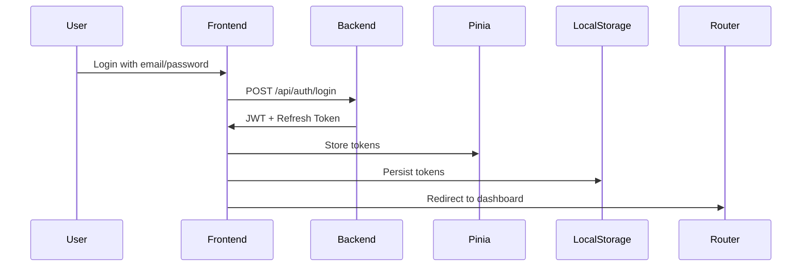

# Educational Platform - Frontend Architecture

## 🎯 Overview

This document outlines the Vue.js frontend architecture for the educational platform, designed to work with the existing Node.js/Express backend. The frontend will provide a responsive, role-based user interface with proper separation of concerns.

## 📁 Project Structure

```
frontend/
├── public/
│   ├── index.html
│   ├── favicon.ico
│   └── assets/
├── src/
│   ├── assets/
│   │   ├── styles/
│   │   ├── images/
│   │   └── icons/
│   ├── components/
│   │   ├── common/
│   │   ├── layout/
│   │   ├── auth/
│   │   ├── courses/
│   │   ├── lessons/
│   │   ├── payment/
│   │   ├── admin/
│   │   └── instructor/
│   ├── composables/
│   │   ├── useAuth.js
│   │   ├── useApi.js
│   │   ├── useValidation.js
│   │   └── useNotification.js
│   ├── router/
│   │   ├── index.js
│   │   └── guards/
│   │       ├── authGuard.js
│   │       └── roleGuard.js
│   ├── stores/
│   │   ├── authStore.js
│   │   ├── userStore.js
│   │   ├── courseStore.js
│   │   └── lessonStore.js
│   ├── services/
│   │   ├── api.js
│   │   ├── authService.js
│   │   ├── courseService.js
│   │   ├── paymentService.js
│   │   ├── lessonService.js
│   │   └── adminService.js
│   ├── utils/
│   │   ├── validators.js
│   │   ├── helpers.js
│   │   └── constants.js
│   ├── views/
│   │   ├── auth/
│   │   ├── courses/
│   │   ├── lessons/
│   │   ├── payment/
│   │   ├── admin/
│   │   ├── instructor/
│   │   └── user/
│   ├── App.vue
│   └── main.js
├── .env
├── .env.development
├── .env.production
├── vite.config.js
└── package.json
```

## 🔧 Technology Stack

### Core Technologies
- **Vue.js 3** - Progressive JavaScript framework
- **Vue Router** - Official routing library
- **Pinia** - State management (replaces Vuex)
- **Vite** - Build tool and development server
- **Axios** - HTTP client for API communication
- **Bootstrap 5** - CSS framework for responsive design
- **VueUse** - Collection of useful composables

### Why These Technologies?
1. **Vue.js 3**: Modern, performant, and easy to learn
2. **Pinia**: Simpler and more intuitive than Vuex
3. **Vite**: Fast development server and optimized builds
4. **Axios**: Promise-based HTTP client with interceptors
5. **Bootstrap 5**: Responsive grid system and components
6. **VueUse**: Reusable utility functions

## 🏗️ Component Architecture

### Layout Components
- `MainLayout.vue` - Base layout with header, footer, and navigation
- `AuthLayout.vue` - Layout for authentication pages
- `DashboardLayout.vue` - Layout for authenticated users
- `AdminLayout.vue` - Layout for admin dashboard
- `InstructorLayout.vue` - Layout for instructor dashboard

### Common Components
- `Navbar.vue` - Navigation bar with role-based menu items
- `Sidebar.vue` - Collapsible sidebar for dashboard views
- `Footer.vue` - Footer with copyright and links
- `Breadcrumb.vue` - Navigation breadcrumbs
- `Loader.vue` - Loading spinner
- `Modal.vue` - Reusable modal component
- `Alert.vue` - Notification alerts
- `Pagination.vue` - Pagination controls

### Authentication Components
- `LoginForm.vue` - Login form with email/password
- `RegisterForm.vue` - Registration form with role selection
- `ForgotPassword.vue` - Password recovery form
- `ResetPassword.vue` - Password reset form

### Course Components
- `CourseCard.vue` - Course preview card
- `CourseList.vue` - Grid/list view of courses
- `CourseDetail.vue` - Detailed course information
- `CoursePurchase.vue` - Course purchase form
- `MyCourses.vue` - User's purchased courses

### Lesson Components
- `LessonRequest.vue` - Live lesson request form
- `LessonList.vue` - List of scheduled lessons
- `LessonDetail.vue` - Detailed lesson information
- `LessonStatus.vue` - Lesson status management (instructor)

### Payment Components
- `PaymentForm.vue` - Payment information form
- `PaymentHistory.vue` - Payment transaction history
- `PaymentSuccess.vue` - Payment success page
- `PaymentFailure.vue` - Payment failure page

### Admin Components
- `UserManagement.vue` - User management interface
- `CourseManagement.vue` - Course management interface
- `InstructorManagement.vue` - Instructor management interface
- `LessonManagement.vue` - Lesson management interface
- `SystemStats.vue` - System statistics dashboard

### Instructor Components
- `StudentList.vue` - List of assigned students
- `Availability.vue` - Availability management
- `LessonSchedule.vue` - Lesson scheduling interface
- `Earnings.vue` - Earnings and payment history

## 🚦 Routing Architecture

### Route Structure
```javascript
const routes = [
  // Public routes
  {
    path: '/',
    component: MainLayout,
    children: [
      { path: '', name: 'Home', component: HomeView },
      { path: 'courses', name: 'Courses', component: CourseListView },
      { path: 'courses/:id', name: 'CourseDetail', component: CourseDetailView }
    ]
  },

  // Authentication routes
  {
    path: '/auth',
    component: AuthLayout,
    children: [
      { path: 'login', name: 'Login', component: LoginView },
      { path: 'register', name: 'Register', component: RegisterView },
      { path: 'forgot-password', name: 'ForgotPassword', component: ForgotPasswordView }
    ]
  },

  // User routes (protected)
  {
    path: '/user',
    component: DashboardLayout,
    meta: { requiresAuth: true, roles: ['user'] },
    children: [
      { path: 'dashboard', name: 'UserDashboard', component: UserDashboardView },
      { path: 'courses', name: 'MyCourses', component: MyCoursesView },
      { path: 'lessons', name: 'MyLessons', component: MyLessonsView },
      { path: 'lessons/request', name: 'RequestLesson', component: RequestLessonView },
      { path: 'payments', name: 'PaymentHistory', component: PaymentHistoryView }
    ]
  },

  // Instructor routes (protected)
  {
    path: '/instructor',
    component: InstructorLayout,
    meta: { requiresAuth: true, roles: ['instructor'] },
    children: [
      { path: 'dashboard', name: 'InstructorDashboard', component: InstructorDashboardView },
      { path: 'students', name: 'MyStudents', component: MyStudentsView },
      { path: 'lessons', name: 'InstructorLessons', component: InstructorLessonsView },
      { path: 'availability', name: 'Availability', component: AvailabilityView },
      { path: 'earnings', name: 'Earnings', component: EarningsView }
    ]
  },

  // Admin routes (protected)
  {
    path: '/admin',
    component: AdminLayout,
    meta: { requiresAuth: true, roles: ['admin'] },
    children: [
      { path: 'dashboard', name: 'AdminDashboard', component: AdminDashboardView },
      { path: 'users', name: 'UserManagement', component: UserManagementView },
      { path: 'instructors', name: 'InstructorManagement', component: InstructorManagementView },
      { path: 'courses', name: 'CourseManagement', component: CourseManagementView },
      { path: 'lessons', name: 'LessonManagement', component: LessonManagementView },
      { path: 'stats', name: 'SystemStats', component: SystemStatsView }
    ]
  },

  // Catch-all route
  { path: '/:catchAll(.*)', name: 'NotFound', component: NotFoundView }
];
```

### Route Guards
- **Auth Guard**: Checks if user is authenticated (has valid JWT)
- **Role Guard**: Verifies user has required role for the route
- **Guest Guard**: Redirects authenticated users away from auth pages

## 🔐 Authentication System

### JWT Storage Strategy
- **Primary Storage**: Pinia store (memory) for active session
- **Persistent Storage**: LocalStorage for session persistence
- **Refresh Token**: Separate refresh token with longer expiry

### Authentication Flow


### Token Management
- **Access Token**: Short-lived (1 hour), used for API requests
- **Refresh Token**: Long-lived (7 days), used to get new access tokens
- **Auto-refresh**: Interceptor checks token expiry and refreshes automatically

## 📦 State Management with Pinia

### Store Structure
```javascript
// authStore.js
export const useAuthStore = defineStore('auth', {
  state: () => ({
    user: null,
    accessToken: null,
    refreshToken: null,
    isAuthenticated: false,
    loading: false,
    error: null
  }),
  actions: {
    async login(credentials) {
      // Login logic
    },
    async logout() {
      // Logout logic
    },
    async refreshToken() {
      // Token refresh logic
    },
    async checkAuth() {
      // Check authentication status
    }
  },
  getters: {
    userRole: (state) => state.user?.role,
    isAdmin: (state) => state.user?.role === 'admin',
    isInstructor: (state) => state.user?.role === 'instructor',
    isUser: (state) => state.user?.role === 'user'
  }
});
```

## 🔌 API Service Layer

### API Service Structure
```javascript
// services/api.js
import axios from 'axios';
import { useAuthStore } from '../stores/authStore';

const api = axios.create({
  baseURL: import.meta.env.VITE_API_BASE_URL || 'http://localhost:3000/api',
  timeout: 10000,
  headers: {
    'Content-Type': 'application/json'
  }
});

// Request interceptor
api.interceptors.request.use((config) => {
  const authStore = useAuthStore();
  if (authStore.accessToken) {
    config.headers.Authorization = `Bearer ${authStore.accessToken}`;
  }
  return config;
});

// Response interceptor
api.interceptors.response.use(
  (response) => response.data,
  async (error) => {
    const authStore = useAuthStore();
    const originalRequest = error.config;

    // Handle 401 errors
    if (error.response.status === 401 && !originalRequest._retry) {
      originalRequest._retry = true;
      try {
        await authStore.refreshToken();
        return api(originalRequest);
      } catch (refreshError) {
        await authStore.logout();
        return Promise.reject(refreshError);
      }
    }

    return Promise.reject(error);
  }
);

export default api;
```

### Service Modules
- **authService.js**: Authentication-related API calls
- **courseService.js**: Course-related API calls
- **paymentService.js**: Payment-related API calls
- **lessonService.js**: Lesson-related API calls
- **adminService.js**: Admin-related API calls

## ✅ Form Validation System

### Validation Approach
- **VueUse Validation**: Use `@vueuse/validate` for form validation
- **Custom Validators**: Reusable validation functions
- **Real-time Validation**: Validate on input change
- **Error Display**: Clear error messages near form fields

### Validation Example
```javascript
// utils/validators.js
export const required = (value) => !!value || 'This field is required';
export const email = (value) => /.+@.+\..+/.test(value) || 'Invalid email format';
export const minLength = (min) => (value) => value.length >= min || `Minimum ${min} characters`;
export const maxLength = (max) => (value) => value.length <= max || `Maximum ${max} characters`;
export const password = (value) => /^(?=.*[a-z])(?=.*[A-Z])(?=.*\d).{8,}$/.test(value) ||
  'Password must contain at least 8 characters, one uppercase, one lowercase, and one number';
```

## ⚠️ Error Handling and Notifications

### Error Handling Strategy
- **API Errors**: Standardized error responses from backend
- **Network Errors**: Handle connection issues gracefully
- **Validation Errors**: Display form validation errors
- **Global Errors**: Show user-friendly error messages

### Notification System
```javascript
// composables/useNotification.js
import { useToast } from 'vue-toastification';

export function useNotification() {
  const toast = useToast();

  const showSuccess = (message) => {
    toast.success(message, {
      timeout: 3000,
      position: 'top-right'
    });
  };

  const showError = (message) => {
    toast.error(message, {
      timeout: 5000,
      position: 'top-right'
    });
  };

  const showWarning = (message) => {
    toast.warning(message, {
      timeout: 4000,
      position: 'top-right'
    });
  };

  const showInfo = (message) => {
    toast.info(message, {
      timeout: 3000,
      position: 'top-right'
    });
  };

  return {
    showSuccess,
    showError,
    showWarning,
    showInfo
  };
}
```

## 🎨 UI/UX Design Principles

### Responsive Design
- Mobile-first approach
- Bootstrap 5 grid system
- Responsive breakpoints
- Touch-friendly controls

### Accessibility
- Semantic HTML
- ARIA attributes
- Keyboard navigation
- Color contrast compliance
- Screen reader support

### Performance Optimization
- Code splitting with Vite
- Lazy loading of components
- Image optimization
- Bundle analysis
- Caching strategies

## 🚀 Implementation Plan

### Phase 1: Project Setup
1. Initialize Vue.js project with Vite
2. Install required dependencies
3. Configure Vite and environment variables
4. Set up basic project structure

### Phase 2: Core Infrastructure
1. Implement Pinia stores
2. Create API service layer
3. Set up Vue Router with guards
4. Implement authentication system

### Phase 3: Layout and Components
1. Create layout components
2. Build common UI components
3. Implement form components
4. Create role-specific components

### Phase 4: Views and Pages
1. Implement authentication views
2. Create course-related views
3. Build lesson management views
4. Develop admin dashboard views
5. Create instructor dashboard views

### Phase 5: Integration and Testing
1. Connect to backend API
2. Implement form validation
3. Set up error handling
4. Test all user flows
5. Fix bugs and optimize

### Phase 6: Deployment Preparation
1. Configure production environment
2. Set up build scripts
3. Implement CI/CD pipeline
4. Prepare deployment documentation

## 📋 API Endpoints Reference

### Authentication
- `POST /api/auth/register` - User registration
- `POST /api/auth/login` - User login
- `GET /api/auth/me` - Get current user info

### Courses
- `GET /api/courses` - Get all courses
- `GET /api/courses/:id` - Get specific course
- `GET /api/courses/instructor/:instructorId` - Get courses by instructor
- `GET /api/courses/purchased/me` - Get user's purchased courses

### Payments
- `POST /api/payment/purchase` - Purchase a course
- `GET /api/payment/history` - Get payment history

### Lessons
- `POST /api/lessons/request` - Request live lesson
- `GET /api/lessons/user/lessons` - Get user's lessons
- `GET /api/lessons/instructor/lessons` - Get instructor's lessons
- `PUT /api/lessons/lesson/status` - Update lesson status

### Admin
- `GET /api/admin/stats` - System statistics
- `GET /api/admin/users` - Get all users
- `GET /api/admin/instructors` - Get all instructors
- `GET /api/admin/courses` - Get all courses
- `POST /api/admin/courses` - Create course
- `PUT /api/admin/courses/:id` - Update course
- `DELETE /api/admin/courses/:id` - Delete course
- `GET /api/admin/lessons` - Get all lessons

## 🔒 Security Considerations

### Frontend Security
- JWT storage in memory (Pinia) and localStorage
- Secure HTTP-only cookies for sensitive data
- CSRF protection
- Input validation and sanitization
- Secure headers
- Rate limiting on client side

### Data Protection
- Encrypt sensitive data before storage
- Secure localStorage access
- Clear tokens on logout
- Session timeout handling
- Secure API communication

## 📈 Performance Metrics

### Target Performance
- **First Contentful Paint**: < 1.5s
- **Time to Interactive**: < 2.5s
- **Bundle Size**: < 500KB (gzipped)
- **API Response Time**: < 300ms
- **Page Load Time**: < 2s

### Optimization Techniques
- Code splitting and lazy loading
- Tree shaking
- Image compression
- Caching strategies
- Minification and compression
- CDN usage for static assets

## 🎓 Future Enhancements

### Planned Features
1. **Real-time Updates**: WebSocket integration
2. **Video Conferencing**: Zoom/Google Meet integration
3. **Chat System**: Real-time messaging
4. **Rating System**: Course and instructor ratings
5. **Advanced Search**: Filtering and search functionality
6. **Progress Tracking**: Course completion tracking
7. **Certificates**: Course completion certificates
8. **Mobile App**: Native mobile applications

### Technical Improvements
1. **TypeScript**: Add type safety
2. **Testing**: Unit and integration tests
3. **Analytics**: User behavior tracking
4. **Monitoring**: Error tracking and logging
5. **CI/CD**: Automated deployment pipeline
6. **Docker**: Containerization for deployment

## 📝 Conclusion

This frontend architecture provides a solid foundation for the educational platform, with clear separation of concerns, role-based access control, and modern Vue.js best practices. The design ensures scalability, maintainability, and a positive user experience across all device types.